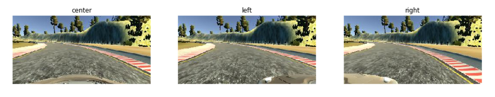
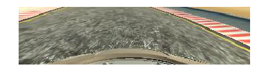
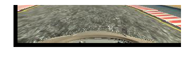
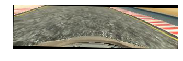
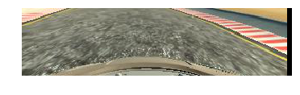
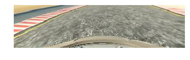
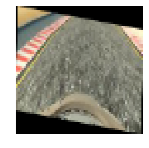
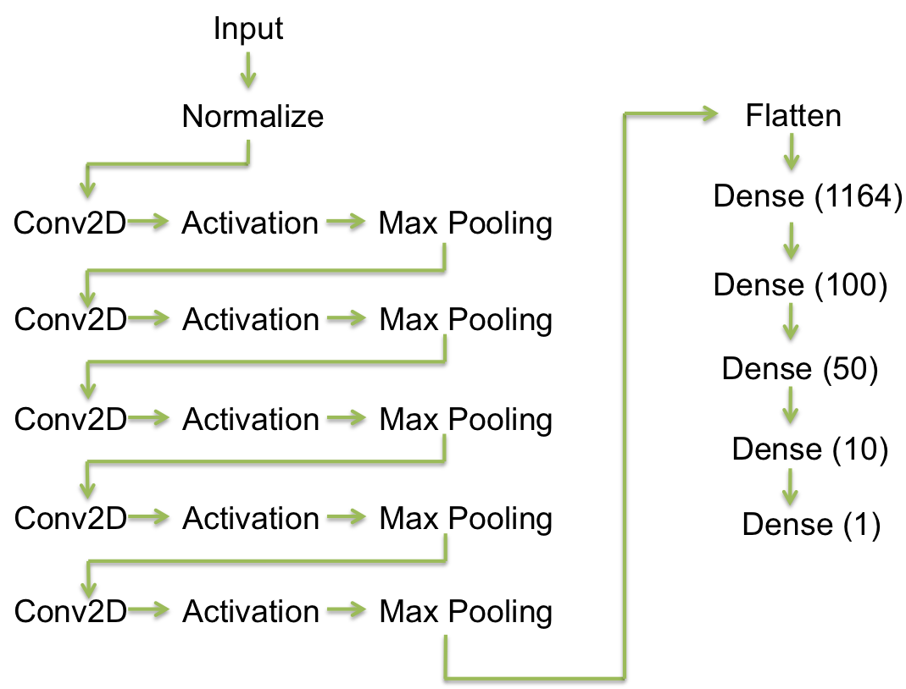
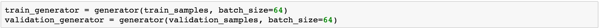

# **Objective**

The main objective of this project is to train a car to behave like a human at driving. For acheiving this, human is required to drive on a test track in a simluator and the simluator logs the images from center, left and right mount cameras in the car along with steering angle at every instant. 

The intent is to teach the car to drive like a human by feeding this data into a deep neural network. Neural network from NVIDIA paper is used to train the network. Images are captured by me driving around the track in the simulator.

# Implementation

While driving in the simulator for collecting training data, I noticed that most of the time the angles were zero as I was driving straight. Also, there were more number of left turns on the track than there were right turns. This would mean that the training data would have more knowledge about turning left than turning right. The highest knowledge it would have is to drive straight. However, that is not the ideal scenario when we put a car on a test track for validation. To make sure that the car does not memorize this track, we would need to process our data.

# Data collection mechanism

Three cameras (center, left and right) were present on the car which were capturing images during collection of data. 'driving_log.csv' file logs all sets of three images along with how much the steering was rotated when those images were captured. 



After going over the track a couple of times, I started with pre-processing of my data that I gathered. 

As we can see in the images above, the important information for our driving is only in the roughly botton half of the image. So I started with cropping my data and taking only bottom half for decision making. 



Once I got the cropped image, I started with regular geometric transformations that opencv had to offer. Doing geometric operations on images imply that we are changing how a camera shot that image. That would mean, for some operations, we would need to change the steering angle as well, when we modify the image. 

I used translate, rotate, flip as operations. The brighteness/contrast of road on two provided tracks was different. So I used brightness to make sure that my model does not memorize the road by its brightness.

I randomly selected an image from left, right or center to make sure that my model will not depend only on center image. The drive.py code is using image from center camera to do its driving. We would need to adjust our steering angle to suit better if we use left or right camera images. I started with a steering correction of 0.1 and then increased it up and found decent results around 0.2. 

Once I randomly selected left/right/center images, those images were then randomly translated, rotated, flipped and brightened. Randomly because I did not want my model to memorize the data when training. 

#### Translate
Translating an images by few pixes either direction should translate the entire road in front of it. Hence, this operation would not require any modification to steering angle




#### Rotate
Rotating an image would mean that the road in front is rotated by an angle. We would need to rotate the steering angle accordingly. 




#### Flipping 
Fipping an image over Y axis means that we need to flip the steering angle as well. When collecting training data, I noticed that I was able to take left turns more smoothly when compared to right turns. Flipping the data would ensure that my model knows smooth right turns as well. Also as there were more left turns than right turns, flipping the image would help for model to learn turning right




#### Brightening 
Just changes the contrast of the image and nothing to the road in front. Hence, no modification to steering angle is needed



#### Reshape

Once all the pre-processing is done on an image, it is resized to 64x64 dimension to be able to feed into our neural network. The neural network I used accepts images at 64x64 scale hence this reshaping



# Model

For training the neural network, I used the network from NVIDIA's paper on 'End to End learning for Self driving cars' with small modifications. 

I started with implementing the model as the paper describes but I had better results if I did not do the color space conversion to yuv before I feed the data into model. Hence, I skipped that and implemented the rest according to my image dimensions. 

Although NVIDIA paper does not list any Dropout mechanisms, I tried implementing Dropout but my results became worse if I used dropout. I tried a dropout of 0.7 in convolution layer and 0.5 in Dense layer. 



Model takes an input of size 64x64x3 and then does a normalization to get everything to between -0.5 to 0.5. 

Model has 5 convolution layers with relu activation after each convolution and a maxpooling with poolsize of 2 and a stride count of 1. For the first three convolution layers, kernel size of 5 is used for the last two, a kernel size of 3 is used. The number of filters are 24, 36, 48, 64 and 64 for each of the convolution layer.

The output of the convolution layers is flattened out and then fed into a series of 5 fully connected layers. First one has an output of 1164 neurons, second one has 100, third one has 50, fourth one has 10 and the output layer is a single neural which predicts the steering angle. After each Dense layer a 'relu' activation layer is applied.

The model is compiled to minimize the mean square loss and for that, Adam optimizer is used. 

# Model explanation

Generators are used to send data in into the model. I started with a batch size of 64 and did not modify that



It was mentioned in the lectures that it is a good idea to split the testing and validation samples in the ratio of 80:20, so I followed that in my model. 

When I first trained my model, the number of images that I captured were around 22760. I rounded it off to the nearest multiple of 64 for having a round number of batches. And then took around roughly 20% of it for validation set

I used a ModelCheckpoint to observe validation_loss and save the model only if it notices an improvement in the model. I ran it for 15 epochs and it started mentioning that 'val_loss did not improve' after few epochs. It saved the best model it found during the epochs running and saved it to model.h5 file.

An adam optimizer is used to minimze the mean square loss

One more thing that I did that made the car stay better on the road is that I noticed it drive and noted down where the car failed to drive properly. Then went back to the track and drove around those areas again and added those images to my data set. This did help the car drive in those areas properly. I repeated these steps till it learnt how to complete the track. However, this had a disadvantage. It looked like my model started memorizing the track and it did not do well in the other track after it completed a loop in the first one

# Output

Video can be found in files/ directory named as run.mp4 along with model named as model.h5

## Points to note

* I wanted to keep only the data that is necessary for decision making. So I cropped the image between the foot of mountain and the bonnet image[65:-15,:,:] and trained my model with it. While validating, I noticed that my model was unable to properly take left turns. One reason I could think of is maybe that I ommitted important information when I cropped out bottom 15 pixels. So I changed my cropping to [80:,:,:]


* Since I captured images over multiple training sessions, I had to make sure that my the images that I logged in driving_log.csv are present in the images folder. That is why I validated it before I proceeded to process my data


* I have few questions 

    * This challenge being a classificaiton problem, the number of angles at which the car can execute a turn are limited by the number of angles that the training set has. This number is limited by the road on which the training is performed. If a car encounters another road which has a turn that requires a very different angle (something like a hair-pin bend), this model would not work. Am I right in thinking so? If yes, can this challenge be modelled as a regression problem instead of classification one?
    
    * Why is that reducing the number of epochs improved the performance? **(Previous reviewer mentioned that my model might be overfitting when i ran it over more epochs and suggested ModelCheckpoint approach)**
    
    * My model did bad on the other track. Maybe because I overtrained it. How can I do better?


```python

```
